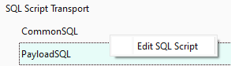

XML Template editor is a view where the xml template definition for the transport package can be organized and prepared for the database transporter tool.

The main view is organized in following sections:

1. **Side Bar** - navigation between views
2. **Database Objects query section** - search for database objects to be included in the transport template
3. **Search results list** - shows the list of database objects returned from the object query section
4. **Object relations management view** - lets you select or unselect object relations
5. **XML Template Editor Tabs** - switch between editor template
6. **XML Structure Tree View** - main view where the transport template structure is built
7. **XML Output File Preview** - shows final xml template structure based on the xml structure tree view

# XML Template Editor Actions

The XML Template Editor view provides a set of minimum actions which should effectively help with the overall structure of the xml template.
It is possible to work "offline" on the templates, however major functionality requires the database connection to load the objects and table relations information. 

## Create new transport template

You can open xml template using the dedicated **menu** action.
New template is opened in new tab and will have the initial xml structure generated (up to **tasks** structure).

## Load existing XML template

You can open xml template using the dedicated **menu** action or from the [Package Manager](Package%20Manager.md) object definitions view integration.
If the file is not recognized, it will be used as target file but empty transport template will be created.

When loading the transport template where object transport tasks with relation configurations are defined, each object container is parsed and can be configured in scope of this xml definition only.

**Note:** Currently only Database Object Transport and SQL Script transport tasks can be fully managed with the xml template editor. Any other task can be only parsed, moved around and deleted.

## Edit XML Template structure

You can edit xml template structure by simple drag and drop operations - these changes can be done on single items or on multi-selected objects.
Application validates and prevents certain movement operations, but it is important that you verify and create correct object structures that can be then parsed by the database transporter tool. 

## Add XML structure nodes

Currently only Database Object Transport and SQL Script transport tasks can be fully managed with the xml template editor. Using the context menu you can create the object transport task or SQL Script task with their respective SQL script nodes.
New transport tasks can be also created by dropping the database object from the search results list, however this functionality requires database connection to operate. SQL Script tasks can be created and managed offline.

## Delete XML structure nodes

You can delete single or multi-selected xml structure nodes by simply pressing the delete key. Application will delete the entry from xml structure of currently active xml template editor.

## Load and list database objects automatically

This action requires database connection to work properly. If no active connection is established, you will get a popup to connect first and try again.
Each of these actions can be initiated from the context menu in the xml structure tree view and is only available for the objects which represent the transport object container.

Automatic listing allows for live preview of how the selected database relations affect the related objects that would be selected by the database transporter - this is only orientational information since in some edge cases this information might not be accurate enough. 

## Save Relation Preset

Transport containers in the Object Transport tasks have usually some sort of relation configured and it is possible to save those relations to be then transferred on different object types.
To save the relation configuration of a specific object transport container, right click the item on the **XML Structure Tree View**  and select the action from the context menu.

## Apply Relation Preset

Saved relation presets are automatically loaded in the  **Object relations management view** when the object container is activated.

Only presets that are relevant for this object type are listed and can be applied.
Select the relation preset that you would like to apply on the container and click apply. This will overwrite any existing relation configurations with the datathat is saved in the preset.

## Edit SQL Scripts

SQL Script tasks can be directly edited from the XML Template Editor UI. 

Simply select the Edit SQL Script from XML Tree View item context menu and the editor will show up.

Once the SQL Script content is accepted, tool will parse it and save it in the right format into the XML structure (mostly the encoding and XObjectKey escaping is done for the database transporter to read and use these scripts correctly). 

## Bulk change the Transport task options 

Transport tasks or task containers have their specific options to be configured - these object specific flags are displayed in the "Options" column where the option respective to the task can be toggled.

In the example of SQL Script transport task the pre-import parameter can be toggled by using "Run At Start" checkbox:

For the Object transport task, the "*DeleteResiduals*" parameter can be toggled with the respective option next to the object transport task container.

In both cases the flags can be applied to single items or in bulk to all selected rows of the same type in the XML Structure Tree View. 
This means that if SQL Script option was toggled, it will be only reflected to other SQL Script tasks only, ignoring other object classes.